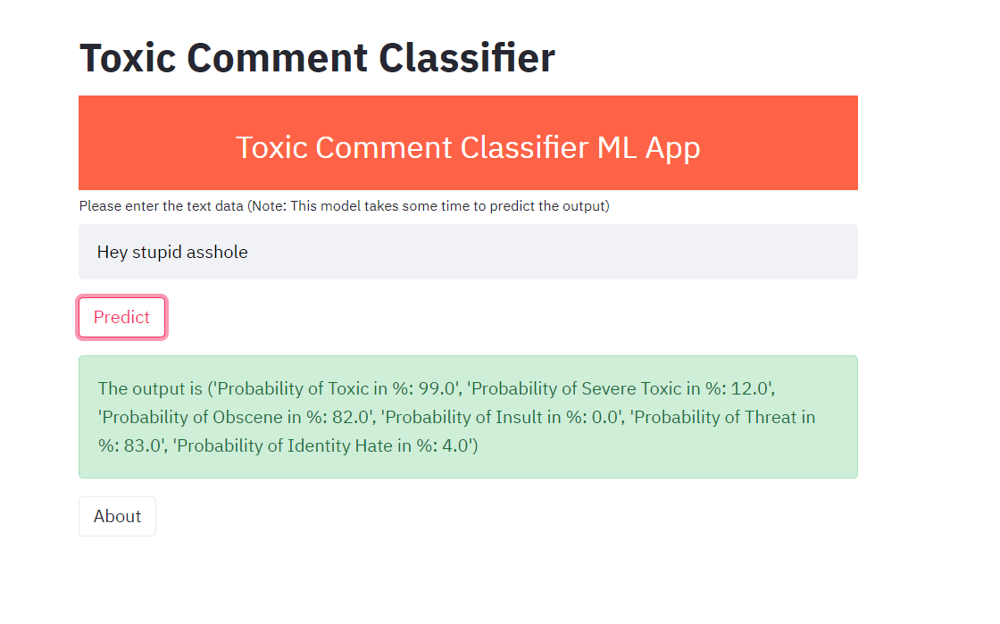

# Toxic-comment-classifiaction

# Task
The major task of this project is to build a web application which predicts the toxicity of different kinds from a given sentence. The task of this project is to predict toxicity with machine Learning. 
Following steps are carried out:
# Steps
1. Analysis of data which has more than 150000 observations from wikipedia chats.
2. various vectorization methods are carried out (TF-IDF and Count Vectorizer) for traditional machine learning model
3. created word embeddings by training my own neural network on corpus and also with word2vec package for Deeplearning approaches.  
4. After comparing the accuracy of both  traditional machine learning and deep learning models, Random forest has been selected whose accuray is 85%.
5. Built a front end User Interface with the help of StreamLit Framework by converting the python file into pickle document
# Note
Heroku deployment was not successful because of large pickle files. It came out that Heroku could not support the Git-LFS file.
Instead i am attaching the local screenshot of my application
Example of app

